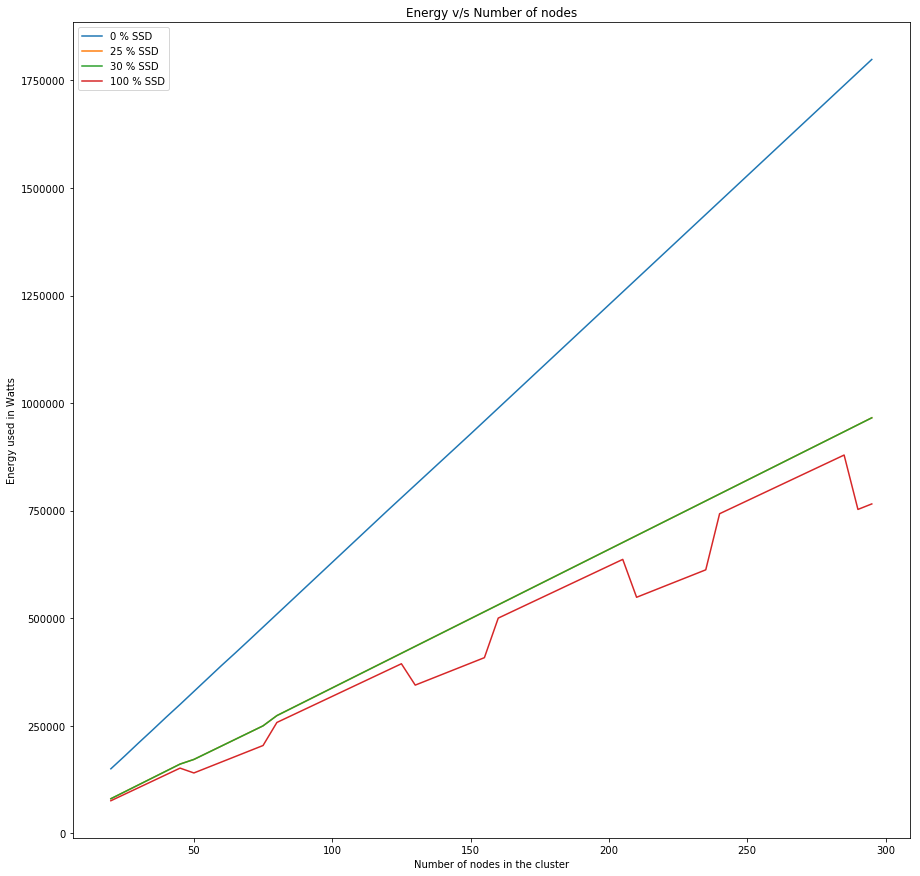

```python
import matplotlib.pyplot as plt
```


```python
with open("Data/blocks_0SSD.txt") as f:
    data = f.read()
temp = data.split('\n')
temp = temp[:len(temp) - 1:]
y_axis_blocks_0SSD = [int(x) for x in temp]
```


```python
with open("Data/blocks_25SSD.txt") as f:
    data = f.read()
temp = data.split('\n')
temp = temp[:len(temp) - 1:]
y_axis_blocks_25SSD = [int(x) for x in temp]
```


```python
with open("Data/blocks_30SSD.txt") as f:
    data = f.read()
temp = data.split('\n')
temp = temp[:len(temp) - 1:]
y_axis_blocks_30SSD = [int(x) for x in temp]
```


```python
with open("Data/blocks_100SSD.txt") as f:
    data = f.read()
temp = data.split('\n')
temp = temp[:len(temp) - 1:]
y_axis_blocks_100SSD = [int(x) for x in temp]
```


```python
x_axis = [x for x in range(1000,5000,50)]
```


```python
plt.rcParams['figure.figsize'] = (15,15)
plt.plot(x_axis, y_axis_blocks_0SSD, label = "0 % SSD")
plt.plot(x_axis, y_axis_blocks_25SSD, label = "25 % SSD")
plt.plot(x_axis, y_axis_blocks_30SSD, label = "30 % SSD")
plt.plot(x_axis, y_axis_blocks_100SSD, label = "100 % SSD")
plt.xlabel("Number of blocks in the cluster. Block size 128 MB")
plt.ylabel("Energy used in Watts")
plt.title("Energy v/s Data size")
plt.legend()
plt.show()
#plt.savefig('Energy-vs-Data.png')
```


**The dip is because blocks are able to fit perfectly into the number of active nodes. The active nodes are utilized fully**


```python
with open("Data/Nodes_0SSD.txt") as f:
    data = f.read()
temp = data.split('\n')
temp = temp[:len(temp) - 1:]
y_axis_nodes_0SSD = [int(x) for x in temp]
```


```python
with open("Data/Nodes_25SSD.txt") as f:
    data = f.read()
temp = data.split('\n')
temp = temp[:len(temp) -1:]
y_axis_nodes_25SSD = [int(x) for x in temp]
```


```python
with open("Data/Nodes_30SSD.txt") as f:
    data = f.read()
temp = data.split('\n')
temp = temp[:len(temp) - 1:]
y_axis_nodes_30SSD = [int(x) for x in temp]
```


```python
with open("Data/Nodes_100SSD.txt") as f:
    data = f.read()
temp = data.split('\n')
temp = temp[:len(temp) - 1:]
y_axis_nodes_100SSD = [int(x) for x in temp]
```


```python
x_axis = [x for x in range(20,300,5)]
```


```python
plt.rcParams['figure.figsize'] = (15,15)
plt.plot(x_axis, y_axis_nodes_0SSD, label = "0 % SSD")
plt.plot(x_axis, y_axis_nodes_25SSD, label = "25 % SSD")
plt.plot(x_axis, y_axis_nodes_30SSD, label = "30 % SSD")
plt.plot(x_axis, y_axis_nodes_100SSD, label = "100 % SSD")
plt.xlabel("Number of nodes in the cluster")
plt.ylabel("Energy used in Watts")
plt.title("Energy v/s Number of nodes")
plt.legend()
plt.show()

#plt.savefig('Energy-vs-Data.png')
```





For every added node, 200 new blocks are initialised.  
**The dips are because blocks are able to fit perfectly into the number of active nodes. The active nodes are utilized fully**


```python
with open("Data/varying_hotZone.txt") as f:
    data = f.read()
temp = data.split('\n')
temp = temp[:len(temp) - 1:]
y_axis_varying_hotZone = [int(x) for x in temp]
x_axis_varying_hotZone = [x for x in range(0,101)]
```


```python
plt.rcParams['figure.figsize'] = (15,15)
plt.plot(x_axis_varying_hotZone, y_axis_varying_hotZone)
plt.xlabel("Percentage of hot nodes in the cluster")
plt.ylabel("Energy used in Watts")
plt.title("Energy v/s Hot Zone percentage")
plt.show()
```


