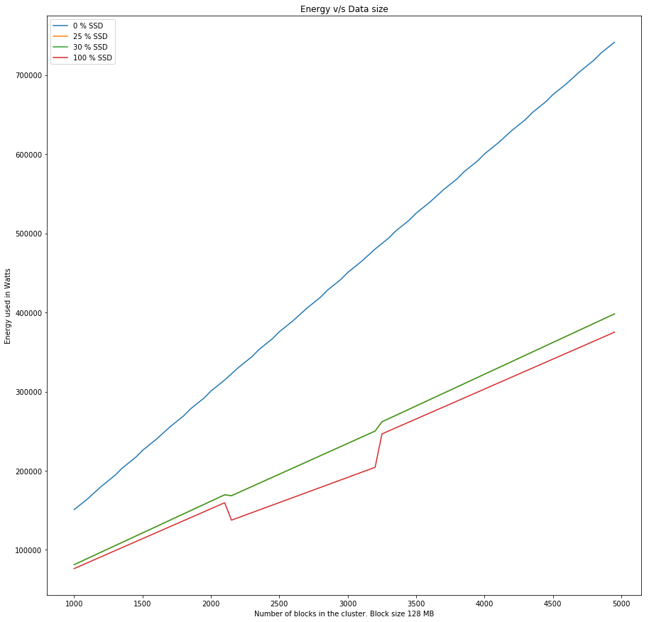
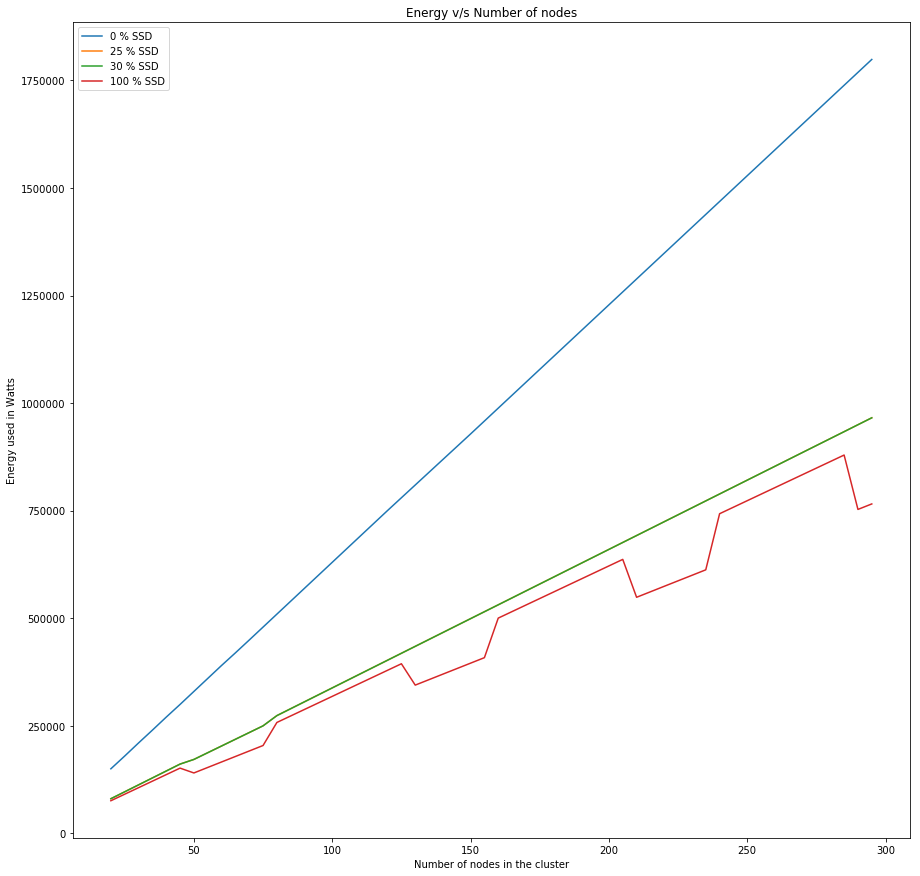
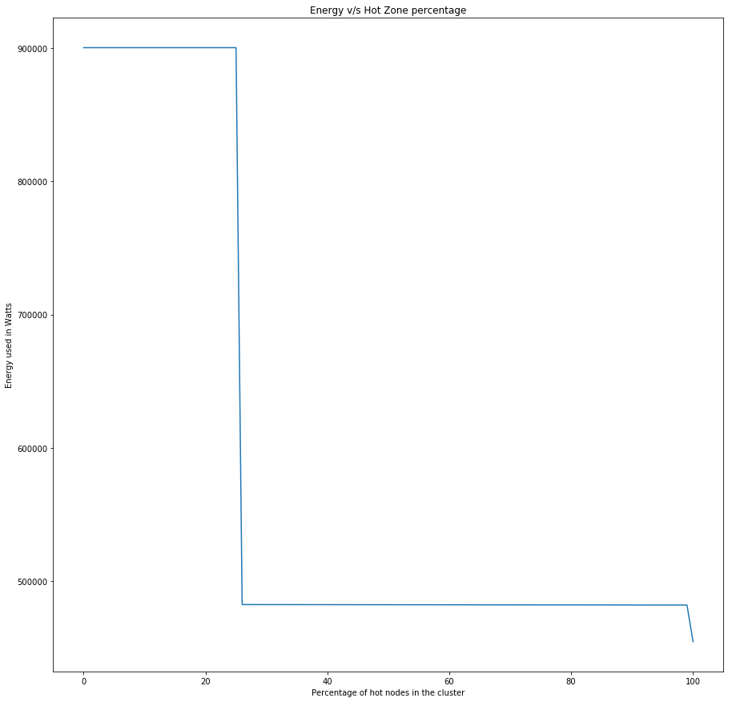

Evaluation of Results
=====================

We used peteratt's simulator to simulate the HDFS architecture and later built on the same to implement our new algorithm. In the following section if there is a reference to the existing algorithm and the new algorithm that means we are refering the results of the unedited version of peteratt's HDFS simulator and the edited version of the peteratt's simulator respectively. 

Multiple-Iterations
-------------------
- Energy Vs Data Size

- Energy Vs Number of nodes

- Energy Vs Hot-Zone percentage

Single-Iteration
-----------------
