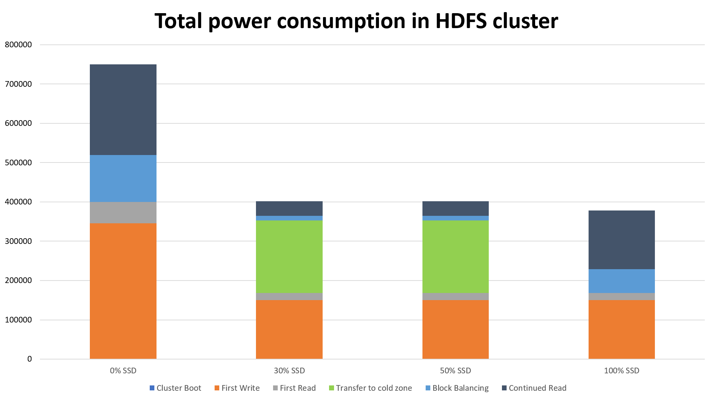

Evaluation of Results
=====================

- Energy Vs Hot-Zone percentage

The above graph shows how the total energy consumed varies when we vary the Hot-Zone percentage in the cluster. Here there is a sudden drop in the energy consumption at about HZ% = 30 because, a minimum of about 30% of the cluster must belong to the hotzone to handle peak workloads, else it defaults to the default hadoop configuration (no hot/cold zone). The second dip at HZ% 100 is because there are no HDDs in the cluster, this indicates that all the nodes in the cluster make use of SSDs, thus saving a significant amount of energy.

- Energy Vs Data Size

- Energy Vs Number of nodes

Single-Iteration
-----------------

### Total power consumption

This is the total energy consumed for the HDFS simulated with the following configurations.  
- Replication factor hot zone : 3  
- Replication factor cold zone : 2  
- Number of nodes : 100  
- Number of Blocks : 75000  
- Percentage of data going cold : 80%

### Split and comparision of different components of power consumption

- During boot

- First read and first write

- Maintaining the HDFS Infrastructure

- Data transfer between the zones

- Block balancing and continued reads
