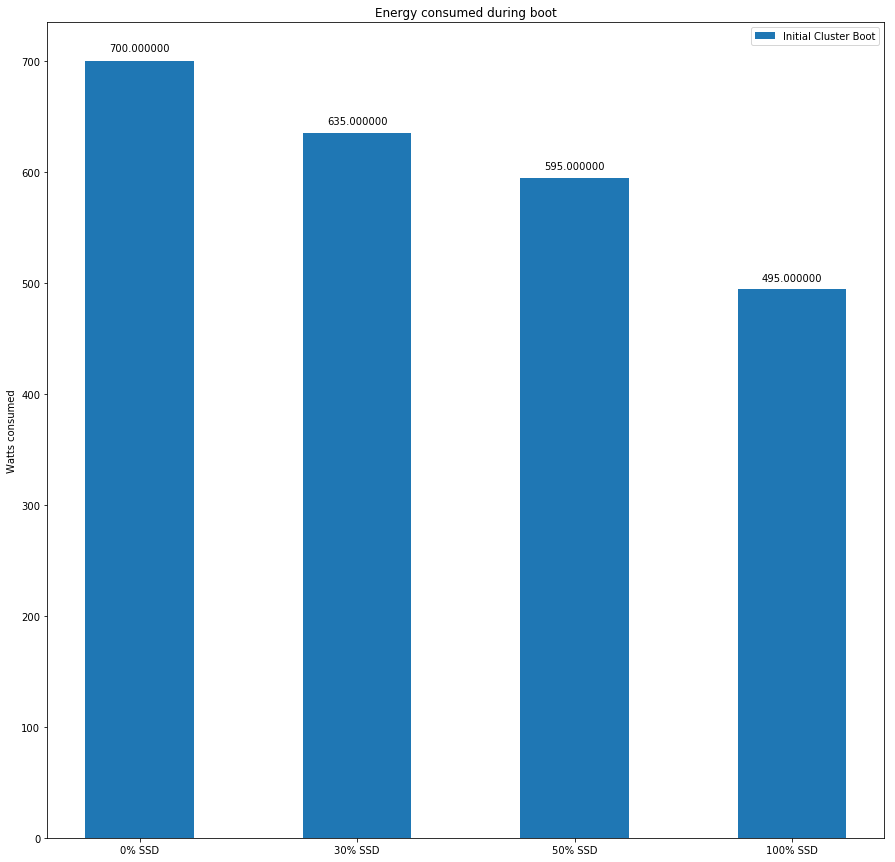
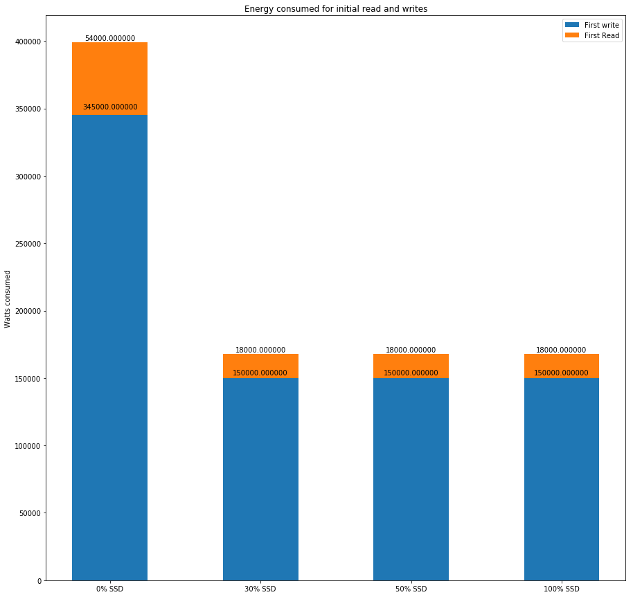
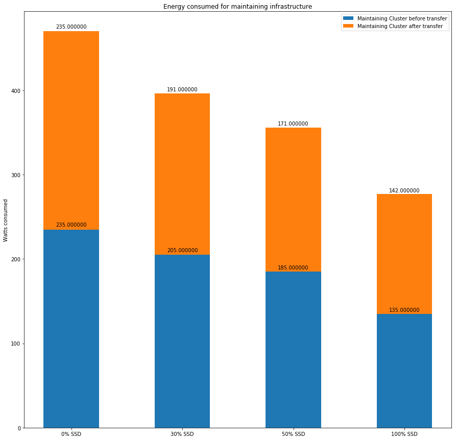
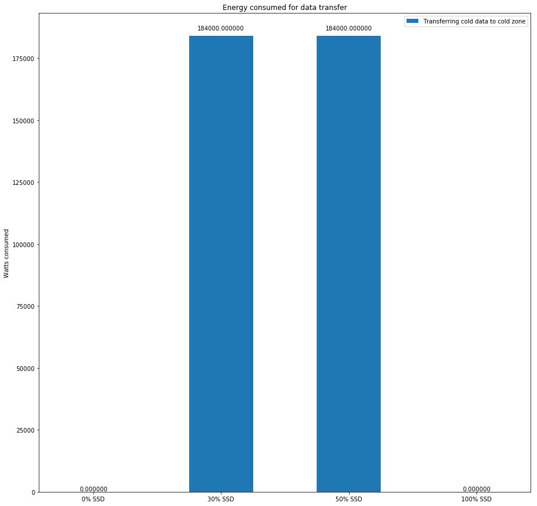

Evaluation of Results
=====================

We used peteratt's simulator to simulate the HDFS architecture and later built on the same to implement our new algorithm. In the following section if there is a reference to the existing algorithm and the new algorithm that means we are refering the results of the unedited version of peteratt's HDFS simulator and the edited version of the peteratt's simulator respectively. 

Multiple-Iterations
-------------------
- Energy Vs Data Size

- Energy Vs Number of nodes

- Energy Vs Hot-Zone percentage

Single-Iteration
-----------------

### Total power consumption

This is the total energy consumed for the HDFS simulated with the following configurations.  
- Replication factor hot zone : 3  
- Replication factor cold zone : 2  
- Number of nodes : 100  
- Number of Blocks : 75000  
- Percentage of data going cold : 80%

### Split and comparision of different components of power consumption

- During boot

- First read and first write

- Maintaining the HDFS Infrastructure

- Data transfer between the zones

- Block balancing and continued reads

