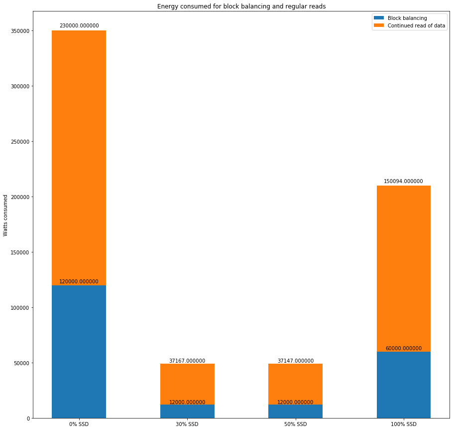
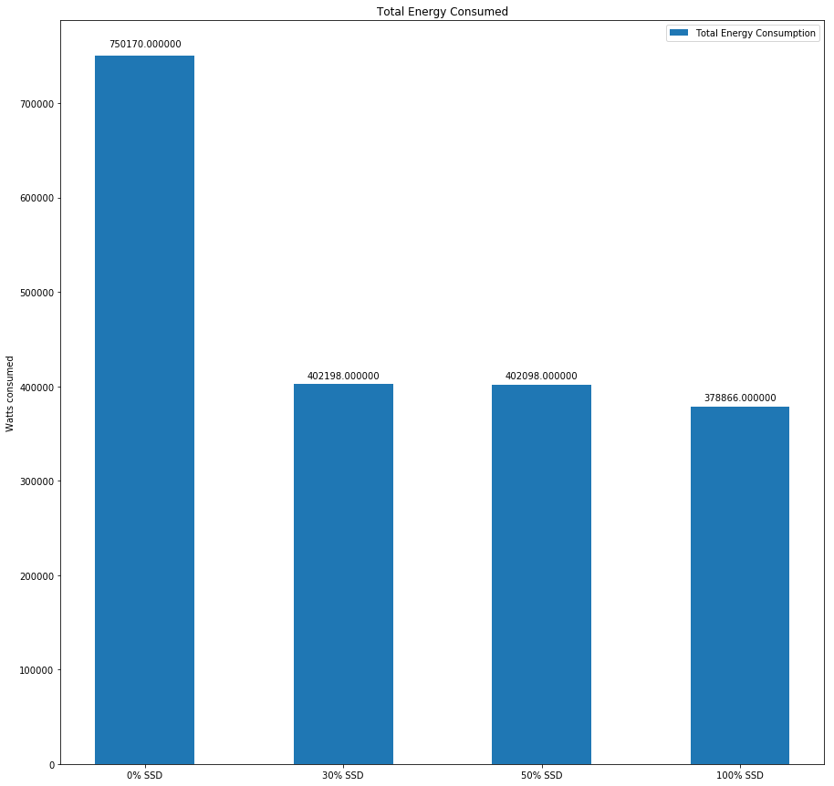

0 % SSD
========
Namenode Created.  
0 SSD Datanodes Created.  
100 HDD Datanodes Created.  


700 Watts of Power consumed for bringing up 100 Nodes  
345000 Watts of Power consumed for initial block distribution (First write)  
54000 Watts of Power consumed for initial Block access (First Read of data)  
235 Watts of Power consumed for maintaining the infrastructure (Cluster in active state)  
0 Watts of Power consumed when transferring data to cold zone  
120000 Watts of Power consumed for block balancing  
235 Watts of Power consumed for maintaining the infrastructure (Cluster in active state)  
230000 Watts of Power consumed for continued Block access (Regular reading of data)  
  
  
Total power consumed = 750170  

30% SSD
=======
Namenode Created.  
30 SSD Datanodes Created.  
70 HDD Datanodes Created.  
5 SSD Datanodes Active.  
  
635 Watts of Power consumed for bringing up 100 Nodes  
150000 Watts of Power consumed for initial block distribution (First write)  
18000 Watts of Power consumed for initial Block access (First Read of data)  
205 Watts of Power consumed for maintaining the infrastructure (Cluster in active state)  
184000 Watts of Power consumed when transferring data to cold zone  
12000 Watts of Power consumed for block balancing  
191 Watts of Power consumed for maintaining the infrastructure (Cluster in active state)  
37167 Watts of Power consumed for continued Block access (Regular reading of data)  
  
  
Total power consumed = 402198  

50% SSD
========
Namenode Created.  
50 SSD Datanodes Created.  
50 HDD Datanodes Created.  
5 SSD Datanodes Active.  
  
595 Watts of Power consumed for bringing up 100 Nodes  
150000 Watts of Power consumed for initial block distribution (First write)  
18000 Watts of Power consumed for initial Block access (First Read of data)  
185 Watts of Power consumed for maintaining the infrastructure (Cluster in active state)  
184000 Watts of Power consumed when transferring data to cold zone  
12000 Watts of Power consumed for block balancing  
171 Watts of Power consumed for maintaining the infrastructure (Cluster in active state)  
37147 Watts of Power consumed for continued Block access (Regular reading of data)  
  
  
Total power consumed = 402098  

100% SSD
=========
Namenode Created.  
100 SSD Datanodes Created.  
0 HDD Datanodes Created.  
5 SSD Datanodes Active.  
  
495 Watts of Power consumed for bringing up 100 Nodes  
150000 Watts of Power consumed for initial block distribution (First write)  
18000 Watts of Power consumed for initial Block access (First Read of data)  
135 Watts of Power consumed for maintaining the infrastructure (Cluster in active state)  
60000 Watts of Power consumed for block balancing  
142 Watts of Power consumed for maintaining the infrastructure (Cluster in active state)  
150094 Watts of Power consumed for continued Block access (Regular reading of data)  
  
  
Total power consumed = 378866  


```python
import numpy as np
import matplotlib.pyplot as plt
```


```python
N = 4

labels = ['0% SSD', '30% SSD', '50% SSD', '100% SSD']

cluster_boot = (700, 635, 595, 495)
first_write = (345000, 150000, 150000, 150000)
first_read = (54000, 18000, 18000, 18000)
cluster_active_1 = (235, 205, 185, 135)
transfer_to_cold_zone = (0, 184000, 184000, 0)
block_balancing = (120000, 12000, 12000, 60000)
cluster_active_2 = (235, 191, 171, 142)
continued_read = (230000, 37167, 37147, 150094)

total = (750170, 402198, 402098, 378866)

```


```python
ind = np.arange(N)
width = 0.5
plt.rcParams['figure.figsize'] = (15,15)

def autolabel2(rects):
    for rect in rects:
        height = rect.get_height()
        heights.append(height)
        ax.text(rect.get_x() + rect.get_width()/2., 1.01*height,'%f' % int(height),ha='center', va='bottom')


def autolabel(rects):
    i = 0
    for rect in rects:
        height = rect.get_height()
        ax.text(rect.get_x() + rect.get_width()/2., 1.01*height + heights[i],'%f' % int(height),ha='center', va='bottom')
        i += 1
        
```


```python
heights = []
fig, ax = plt.subplots()
rects1 = ax.bar(labels, cluster_boot, width, label = 'Initial Cluster Boot')
ax.set_ylabel('Watts consumed')
ax.set_title('Energy consumed during boot')
ax.legend()
autolabel2(rects1)
plt.show()
```


```python
heights = []

fig, ax = plt.subplots()
rects1 = ax.bar(labels, first_write, width, label = 'First write')
rects2 = ax.bar(labels, first_read, width, bottom = first_write, label = 'First Read')
ax.set_ylabel('Watts consumed')
ax.set_title('Energy consumed for initial read and writes')
autolabel2(rects1)
autolabel(rects2)
ax.legend()
plt.show()
```


```python
heights = []
fig, ax = plt.subplots()
rects1 = ax.bar(labels, cluster_active_1, width, label = 'Maintaining Cluster before transfer')
rects2 = ax.bar(labels, cluster_active_2, width, bottom = cluster_active_1, label = 'Maintaining Cluster after transfer')
ax.set_ylabel('Watts consumed')
ax.set_title('Energy consumed for maintaining infrastructure')
ax.legend()
autolabel2(rects1)
autolabel(rects2)
plt.show()
```


```python
fig, ax = plt.subplots()
rects1 = ax.bar(labels, transfer_to_cold_zone, width, label = 'Transferring cold data to cold zone')
#ax.bar(labels, cluster_active_2, width, bottom = cluster_active_1, label = 'Maintaining Cluster after transfer')
ax.set_ylabel('Watts consumed')
ax.set_title('Energy consumed for data transfer')
ax.legend()
autolabel2(rects1)
plt.show()
```


```python
heights = []
fig, ax = plt.subplots()
rects1 = ax.bar(labels, block_balancing, width, label = 'Block balancing')
rects2 = ax.bar(labels, continued_read, width, bottom = block_balancing, label = 'Continued read of data')
ax.set_ylabel('Watts consumed')
ax.set_title('Energy consumed for block balancing and regular reads')
ax.legend()
autolabel2(rects1)
autolabel(rects2)
plt.show()
```





```python
fig, ax = plt.subplots()
#ax.bar(labels, cluster_boot, width, label = 'Initial Cluster Boot')
#ax.bar(labels, cluster_active_1, width, bottom = cluster_boot, label = 'Cluster Active')

rects1 = ax.bar(labels, total, width, label = 'Total Energy Consumption')

ax.set_ylabel('Watts consumed')
ax.set_title('Total Energy Consumed')
autolabel2(rects1)
ax.legend()

plt.show()
```





```python

```
